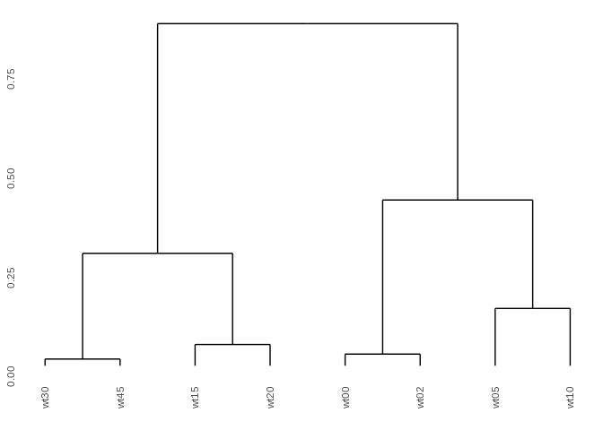
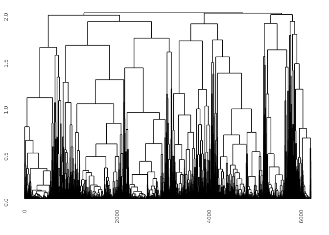

RNAseq Clustering
================
Matthew Berginski
3/11/2020

This is a quick run through using hierarchical clustering to build a set
of gene clusters from the yeast time series data. Step 1: load the data

``` r
load(here('RNAseq_wtHL/wttp.RData'))
```

This R data object has a normalized expression count named
seqdata\_RPKM, which I’ll use for the rest of the clustering steps.

# Time Point Clustering

Just as a quick check, I’ll see where the individual time points cluster
in correlation space.

``` r
time_point_cor = amap::Dist(t(seqdata_RPKM), method = "correlation")

time_point_hclust = hclust(time_point_cor)
```

``` r
ggdendrogram(time_point_hclust)
```

<!-- -->

This is reassuring, namely that the 0/2, 5/10, 15/20 and 30/45 time
points are clustering together. Onto the gene level clustering.

# Gene Clustering

``` r
gene_cor = amap::Dist(seqdata_RPKM, method = "correlation")

gene_hclust = hclust(gene_cor)
```

``` r
ggdendrogram(gene_hclust, labels=F)
```

<!-- -->

Maybe try out a map projection of the correlation matrix to see if there
is any obvious structure.

``` r
#gene_cor_umap = cor(t(seqdata_RPKM))

#umap_points = umap(gene_cor_umap)
```

Blocking this for now for computation time reasons…

# Gene Cluster Extraction

This is a bit of an art, without very clear guidelines about where to
cut the tree to produce the gene cluster grouping. Here’s some sample
code to give 25 clusters.

``` r
gene_clusters_25 = cutree(gene_hclust, k = 25)

tidy_clusters = as.data.frame(gene_clusters_25) %>%
  rownames_to_column(var = "gene_name")

tidy_cluster_counts = tidy_clusters %>%
  count(gene_clusters_25)
```

``` r
# ggplot(tidy_cluster_counts, aes(x=n)) + geom_bar(stat="identity")
```
